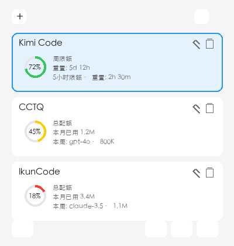
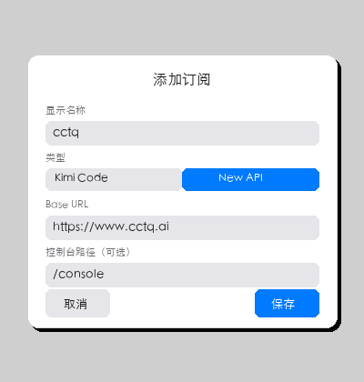
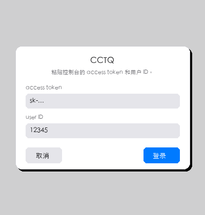

# Coding Plan Plugin for macOS

[](https://www.apple.com/macos)
[](https://swift.org)
[](https://developer.apple.com/xcode/swiftui/)
[](LICENSE)

一个轻量的 macOS 菜单栏插件，常驻屏幕右上角，帮助你一目了然地查看 **Kimi Code** 与各类 **New API** 平台的用量配额。



## 功能特性

- 🖥️ 常驻 macOS 菜单栏，点击图标展开用量面板
- 🔐 所有登录凭证安全存储在系统 Keychain
- 📊 支持多订阅卡片，拖拽排序
- 🔔 菜单栏图标旁实时显示用量预警（>50% 显示百分比，>90% 显示 ⚠️）
- 🔄 手动刷新 + 每 5 分钟自动刷新已有快照
- 🌐 一键打开对应 Provider 控制台
- 🌍 中 / 英双语界面

## 支持的订阅类型

### Kimi Code

通过 OAuth device-code flow 在浏览器中授权，插件独立管理 token，无需手动复制 access token。

### New API

支持所有基于 [one-api](https://github.com/songquanpeng/one-api) / [new-api](https://github.com/Calcium-Ion/new-api) 的平台，例如：

- `https://www.cctq.ai`
- `https://api.ikuncode.cc`
- 任何其他自定义 Base URL 的平台

每个 New API 订阅需要：

- **Base URL**：控制台域名，如 `https://www.cctq.ai`
- **access token**：在控制台「令牌」或「个人设置」中生成
- **user ID**：控制台中显示的用户 ID（通常为纯数字）
- **控制台路径**（可选）：默认为 `/console`

## 安装

1. 下载最新 Release：`CodingPlanPlugin-v1.0.dmg`
2. 打开 DMG，将 `CodingPlanPlugin.app` 拖到 **Applications** 文件夹
3. 从 Applications 启动应用
4. 点击屏幕右上角菜单栏中的  图标开始使用

> 首次启动可能需要到 **系统设置 → 隐私与安全性** 中允许打开。

## 使用说明

### 添加订阅

点击面板左上角的 `+` 按钮，选择类型：

- **Kimi Code**：直接保存，后续点击卡片上的「登录」完成浏览器授权
- **New API**：填写显示名称、Base URL、控制台路径后保存



### 登录 New API

对于 New API 卡片，点击「登录」按钮，在弹窗中粘贴：

- `access token`
- `user ID`

然后点击「登录」，插件会自动获取最新用量。



### 管理订阅

- 点击卡片可选中
- 点击卡片右上角的 ✏️ 编辑订阅信息
- 点击卡片右上角的 🗑️ 直接删除订阅并清理对应 Keychain 凭证
- 拖拽卡片可调整顺序

### 刷新数据

- 点击面板底部 ↻ 刷新按钮手动刷新所有卡片
- 面板首次显示时，会自动刷新尚未获取过用量快照的卡片

## 开发构建

```bash
git clone https://github.com/yangyu/coding-plan-plugin-for-macos.git
cd coding-plan-plugin-for-macos
swift build
swift run
```

> 要求：macOS 13+，Xcode 16 / Swift 6.3

## 项目结构

```
Sources/CodingPlanPlugin/
├── CodingPlanPluginApp.swift        # @main MenuBarExtra 入口
├── Models/                          # 数据模型
├── Providers/                       # Provider 协议与实现
│   ├── KimiProvider.swift
│   └── NewAPIProvider.swift
├── Network/                         # API 客户端
│   ├── KimiAPIClient.swift
│   └── NewAPIClient.swift
├── Services/                        # 认证、Keychain、配置管理
│   ├── KimiCodeAuthService.swift
│   ├── NewAPIAuthService.swift
│   ├── KeychainStorage.swift
│   └── ProviderManager.swift
└── Views/                           # SwiftUI 视图
    ├── UsagePanelView.swift
    ├── ProviderEditView.swift
    ├── SubscriptionCard.swift
    ├── SubscriptionCardList.swift
    └── DeviceLoginView.swift
```

## 安全说明

- 所有凭证统一存储在 macOS Keychain，service 为 `com.yangyu.CodingPlanPlugin`
- 首次启动时会自动将旧版独立 Keychain item 迁移到统一格式并删除旧项
- 网络日志仅记录 URL 与响应预览，**不会**打印 `Authorization`、`New-Api-User` 或 token 内容
- 不收集任何用户数据，所有 API 请求均直连对应服务商

## 许可证

[MIT](./LICENSE)
